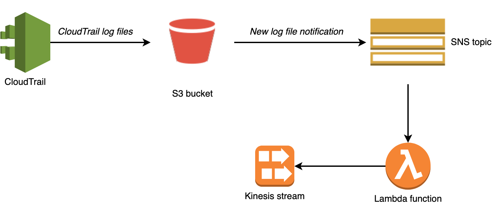
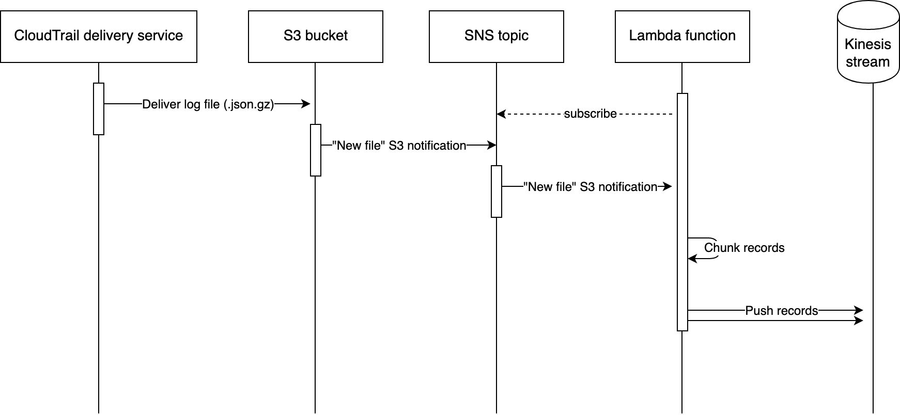
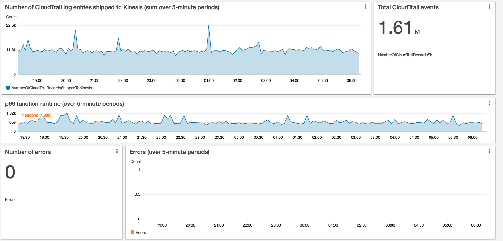

# AWS infrastructure to ship CloudTrail logs from S3 to Kinesis

This repository contains a Terraform module to ship CloudTrail logs stored in a S3 bucket into a Kinesis stream for further processing and real-time analysis.

Use-cases include shipping CloudTrail logs of an organization trail to a SIEM (such as Splunk) or third-party service provider.

## Architecture





In summary:
- A S3 bucket notification is configured to trigger a SNS event every time AWS delivery a new CloudTrail log file to the S3 bucket.

- A subscription is set up so that a Lambda function is invoked for every SNS event, i.e. every time AWS delivers a new CloudTrail log file to the S3 bucket.

- The Lambda function picks up the information that a new file was uploaded, reads this file from S3 and writes it to Kinesis.

## Pre-requisites

- A CloudTrail [organization trail](https://docs.aws.amazon.com/awscloudtrail/latest/userguide/creating-trail-organization.html) must already be configured to ship organization-wide CloudTrail logs to a S3 bucket

- This S3 bucket ("CloudTrail S3 bucket") must already exist

- The CloudTrail S3 bucket must be in the same AWS account and region as the one the module is instantiated

## Usage

### Inputs

| Name | Description | Type | Default | Required |
|------|-------------|------|---------|:--------:|
| <a name="input_cloudtrail-bucket-name"></a> [cloudtrail-bucket-name](#input\_cloudtrail-bucket-name) | Name of the S3 bucket in which CloudTrail logs are stored (must exist and properly configured to receive CloudTrail logs prior to calling this module) | `string` | n/a | yes |
| <a name="input_cloudtrail-sns-topic-name"></a> [cloudtrail-sns-topic-name](#input\_cloudtrail-sns-topic-name) | Name of the SNS topic where information about newly shipped CloudTrail log files are sent | `string` | `"organization-trail-event-notification-topic"` | no |
| <a name="input_cloudwatch-logs-retention-time-days"></a> [cloudwatch-logs-retention-time-days](#input\_cloudwatch-logs-retention-time-days) | Retention period for the CloudWatch logs of the Lambda function (in days) | `number` | `7` | no |
| <a name="input_kinesis-num-shards"></a> [kinesis-num-shards](#input\_kinesis-num-shards) | Number of shards to use in the Kinesis stream | `number` | `4` | no |
| <a name="input_kinesis-retention-time-days"></a> [kinesis-retention-time-days](#input\_kinesis-retention-time-days) | Retention period of the Kinesis stream (in days) | `number` | `7` | no |
| <a name="input_kinesis-stream-kms-key-id"></a> [kinesis-stream-kms-key-id](#input\_kinesis-stream-kms-key-id) | ID of the KMS key to use for encrypting the Kinesis stream | `string` | `"alias/aws/kinesis"` | no |
| <a name="input_kinesis-stream-name"></a> [kinesis-stream-name](#input\_kinesis-stream-name) | Name of the Kinesis stream used for aggregation | `string` | `"cloudtrail-logs-stream"` | no |
| <a name="input_lambda-memory"></a> [lambda-memory](#input\_lambda-memory) | Memory to allocate to the Lambda function | `number` | `512` | no |

### Outputs

| Name | Description |
|------|-------------|
| <a name="output_kinesis-stream-arn"></a> [kinesis-stream-arn](#output\_kinesis-stream-arn) | ARN of the newly created Kinesis stream |
| <a name="output_kinesis-stream-name"></a> [kinesis-stream-name](#output\_kinesis-stream-name) | Name of the newly created Kinesis stream |
| <a name="output_sns-topic-arn"></a> [sns-topic-arn](#output\_sns-topic-arn) | arn of the newly creates SNS topic |
| <a name="output_sns-topic-name"></a> [sns-topic-name](#output\_sns-topic-name) | Name of the newly creates SNS topic |

### Example usage

Sample usage:

```hcl
provider "aws" {
  region = "eu-west-1"
}

// Ship CloudTrail logs that AWS ships in "my-organization-trail-s3-bucket" into a Kinesis stream "cloudtrail-logs"
module "cloudtrail-to-kinesis" {
  source                      = "github.com/nexthink/terraform-aws-cloudtrail-s3-to-kinesis"
  cloudtrail-bucket-name      = "my-organization-trail-s3-bucket"
  kinesis-stream-name         = "cloudtrail-logs"
  kinesis-retention-time-days = 7
}
```

## Monitoring

### Logs

Logs of the Lambda function are sent to a CloudWatch log group. Invocation rate and success/error rate can be seen directly from the AWS console, under the "Monitoring" tab of the Lamdba function

### Observability

The module creates a custom CloudWatch metric `NumberOfCloudTrailRecordsShippedToKinesis`, allowing to have visibility on the total number of CloudTrail events shipped by the Lambda function. When used conjointly to the default [AWS Lambda CloudWatch metrics](https://docs.aws.amazon.com/lambda/latest/dg/monitoring-metrics.html), it allows to easily build a CloudWatch dashboard to monitor the volume of logs processed by the Lambda function, as well as any potential errors.



## Unit tests

Run the Lambda function unit tests using:

```
$ cd lambda
$ make test
AWS_SECRET_ACCESS_KEY= AWS_ACCESS_KEY_ID= python -m unittest discover tests -v
test_extract (test_extract.TestExtract) ... ok
test_entrypoint (test_lambda_entrypoint.TestLambdaEntryPoint) ... 2021-04-09 16:38:33,062 Reading CloudTrail log file s3://my-cloudtrail-bucket/dir/to/cloudtrail.json.gz
2021-04-09 16:38:33,066 Writing CloudTrail log payload to Kinesis (27596 bytes)
ok
test_writes_to_kinesis (test_load.TestLoad) ... 2021-04-09 16:38:33,124 Found credentials in environment variables.
2021-04-09 16:38:33,155 Writing CloudTrail log payload to Kinesis (24 bytes)
ok
test_returns_correct_data_from_s3 (test_transform.TestExtract) ... 2021-04-09 16:38:33,236 Found credentials in environment variables.
2021-04-09 16:38:33,300 Reading CloudTrail log file s3://my-bucket//path/to/cloudtrail-file.json.gz
ok

----------------------------------------------------------------------
Ran 4 tests in 0.532s

OK
```

## End-to-end tests

[End-to-end tests](./test/infra_test.go]) use [Terratest](https://terratest.gruntwork.io/) to spin up real infrastructure, create a S3 bucket, ship a sample CloudTrail log file to it and check that the expected record is produced in Kinesis.

```
# Pre-requisite: ensure you are authenticated against a test/CI AWS account
# $ aws-vault-exec ci-account

$ cd test/
$ go test
```

End-to-end tests take around 2-3 minutes to run.

## Examples

See the [examples/](./examples) folder for complete usage examples.